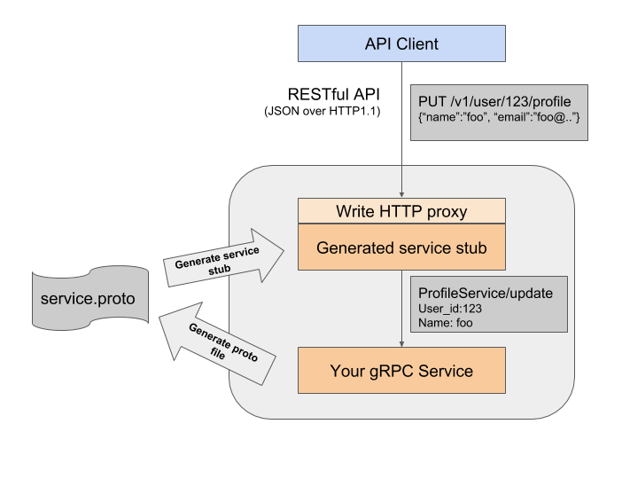

# ballerina gRPC gateway
In gRPC, request/response messages of the service method varies from service to service. So we cannot write generic gRPC gateway implementation which can apply any gRPC service. So Ideally this client proxies should automatically generated from protobuf tool. But this is not supported in Ballerina proto tool. So main idea about this project is to modify generated service stub code to act as reverse proxy as shown in diagram below,




## How to run backend gRPC service.

Execute the following command to build the 'service' package.
```
_$ ballerina build service_
```

Once you build the project, the following files will be generated inside target directory.
 * service.balx
 * grpc/UserProfile.proto
 
Run the service using the following command.
```
_$ ballerina run target/service.balx_
```

## How to run gRPC gateway.

Execute the following command to build the 'client' package.
```
_$ ballerina build gateway_
```

Run the client using the following command.
```
_$ ballerina run target/gateway.balx_
```

## Testing

To test the functionality of the gRPC gateway service, send HTTP requests for each user management operation.
Following are sample cURL commands that you can use to test each operation of the user management service.

**Add New User** 
```bash
$ curl -v -X POST -d \
'{"name":"Sam", "age":24, "email":"sam@gmail.com"}' \
"http://localhost:9091/v1/user" -H "Content-Type:application/json"

Output :  
< HTTP/1.1 201 Created
< content-type: text/plain
< content-length: 31
< server: ballerina/0.981.0

user id 2 created successfully 
```

**Retrieve User Info** 
```bash
$ curl "http://localhost:9091/v1/user/2"

Output : 
{"id":"2", "info":{"name":"Sam", "age":24, "email":"sam@gmail.com"}}
```

**Update User Info** 
```bash
curl -X PUT -d '{"name":"Sam", "age":30, "email":"sam@gmail.com"}' \
"http://localhost:9091/v1/user/2" -H "Content-Type:application/json"

Output: 
"user id 2 updated successfully."
```

**Delete User** 
```bash
curl-X DELETE "http://localhost:9091/v1/user/2"

Output:
"user id 2 deleted successfully."
``` 

**Retrieve all User Info** 
```bash
curl "http://localhost:9091/v1/user"

Output:
[{"id":"0", "info":{"name":"John", "age":25, "email":"john@gmail.com"}}, {"id":"1", "info":{"name":"Sam", 
"age":24, "email":"sam@gmail.com"}}]
``` 
